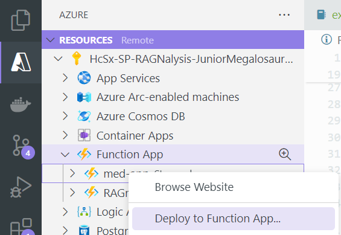

## RAG-based Query Engine Deployed in Azure Function App with Azure-hosted Pre-trained Models

This repository is part of the RAGNalysis project. This code is more focused on the cloud infrastructure rather than the retrieval component of RAG.

<br>

### Architecture


* **LLM Backend**: This layer provides the pretrained LLM models for embedding and inference. 3 different Azure resources are used for experimentation purposes, but in production, only a single provider and model will be used.
    * _ML Studio_: Provides easily deployable endpoints for common LLM models. Most endpoints are real-time and operate 24/7 so these are the most inflexible and expensive models to host. Alternatively, custom models can be deployed via PromptFlow through ML Studio.
    * _AI Studio_: Provides pay-as-you-go endpoints for the far more powerful GPT models that cannot be self-hosted due to their size.
    * _Containerized App_: Provides highly flexible access to models. Are based on GGUF files from HuggingFace but take longer to set up compared to ML Studio models and are weaker than AI Studio models.

* **RAG Engine**: This is the 'heart' that connects to all the infrastructure. It exposes endpoints to each model that the user sends prompts to, then returns the augmented response by processing the input and passing it through the LLM backend. 
    * _Azure Function App_: This is an Azure resource specialized around event-driven microservices with short processes. Alternatives are Azure Container Apps (for standalone applications) and Azure Web Application (for websites).

* **Accessory Services**: Complements the RAG engine by monitoring and persisting telemetry data. Also serves as a centralized location for data storage. 


<br>

### Usage

Refer to the demo notebooks for usage:

| Notebook | Description |
| -------- | ----------- |
| `experiment.ipynb` | Demo of the inference API via the `RagnalysisClient` class that wraps around the API. |
| `api_demo.ipynb` | Demo of directly querying the **LLM Backend** for inference without going through the Azure Function App. | 
| `storage_api_demo.ipynb` | Demo of directly querying the **Storage Layer** to read models into memory and use them for inference. |

<br>

### Development

> Note: For pushing directly from VSCode to Azure Function App, you will need VSCode v1.87.1. This is not the version on Company Portal 

For setting up the project for development:

1. Clone the repository
2. Add a `.env` file in the root directory of `function/` AND the project root directory (for using the experiment notebook) with the below template. Please contact a developer for the API keys. Alternatively, you could try to find them through Azure:
    * **AI Studio** (`OPENAI_KEY`): A single openAI key provides access to all models. This can be found in the settings page
    * **Storage** (`STORAGE_URL`, `STORAGE_KEY`): These are found in the 'Storage Account' associated with the Function App
    * **Function Key** (`FUNCTION_KEY`): This is the Azure Functions App key.

```
OPENAI_KEY=
FUNCTION_KEY=
STORAGE_KEY=
STORAGE_URL=
```

3. Create a `local.settings.json` file in the `function` directory. The purpose of this file is to simulate the Azure environment by defining environment variables that are only accessible in the Azure environment. Contact a developer for these 

```py
{
  "IsEncrypted": false,
  "Values": {
    "AzureWebJobsStorage": "",
    "FUNCTIONS_WORKER_RUNTIME": "python",
    "AzureWebJobsFeatureFlags": "EnableWorkerIndexing",
    "BlobStorageConnectionString": "",
    "OPENAI_KEY": "",
    "CONNECTION_STRING": "",
    "STORAGE_KEY": "",
    "STORAGE_URL": "",
    "STORAGE_CONTAINER": "app-data",
    "MISTRAL_MODEL": "mistralai-mistral-7b-instruct-5",
    "MISTRAL_ENDPOINT": "jludq",
    "MISTRAL_KEY": "",
    "LLAMA_MODEL": "llama-2-7b-chat-18",
    "LLAMA_ENDPOINT": "ebbtk",
    "LLAMA_KEY": ""
  }
}
```

4. Install the 'Azure Functions App' extension and sign into Azure via this extension
5. Use the extension to locally test the endpoint. This creates endpoints on localhost that you can make `get` requests to via the URL (or Python code). You may have to re-open VSCode to the `function` directory as the root.


6. Use the extension to publish the code to Azure Function App OR push to GitHub, get it into the main branch, and run the GitHub Actions workflow to update the Azure Function App




